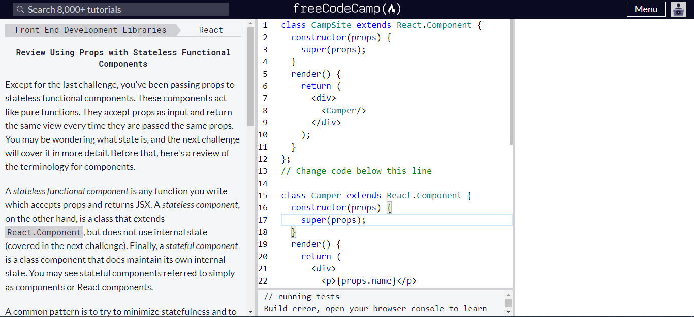

# Ejercicios React 2

## 1. Ejercicios

### Ejercicio 1

Haz los siguientes ejercicios de Freecodecamp / React:
- Desde el ejercicio “Create a Stateless Functional Component” a “Use the Lifecycle Method componentDidMount” incluido.



(Solo he hecho la mitad de momento porque me he agobiado)

### Ejercicio 2

- Crea un componente counter (funcional) que contenga:
    - botón de decremento
    - contador
    - botón de incremento
- El componente mostrará un contador y podremos incrementarlo o decrementarlo en función de si pulsamos un botón u otro
- Que al instanciarlo pueda:
    - Que el contador pueda empezar desde un determinado número
    _(Cambiar initialValue en App.jsx)_
    - Que podamos decirle al componente si queremos que incremente de 2 en 2, 3 en 3, etc.
    _(Cambiar setCounter(counter +- X) en Counter.jsx)_


## 2. Crea una página de un restaurante

Crea una página de un restaurante con React (utilizando componentes funcionales).
- Debe contener al menos un componente “Home” & “Header”
- En el componente Home debes pintar el siguiente array:

```JS
const dishes = [
    {
        id:1,
        name:'plato 1',
        description:'Este es el plato 1',
        price:10
    },
    {
        id:2,
        name:'plato 2',
        description:'Este es el plato 2',
        price:20
    },
    {
        id:3,
        name:'plato 3',
        description:'Este es el plato 3',
        price:15
    }
]
```

- Dicho array le llegará por props del componente padre
- Importante el diseño

### 2.2. Extra

- Implementar responsive
- Rehacer el ejercicio 2 en componente de classes.
- Rehacer la página del restaurante utilizando componentes de classes.